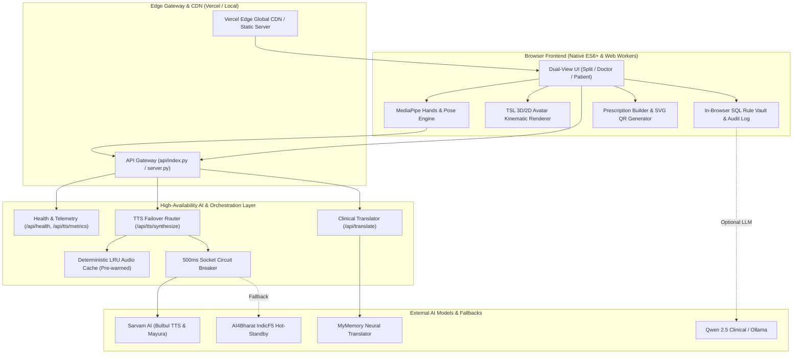

# 🫀 மருத்துவ TSL — Maruthuva TSL
### Tamil Sign Language Medical AI Diagnostic & Clinical Communication Bridge

[](https://vercel.com)
[](https://python.org)
[](https://developer.mozilla.org)
[](#5-architecture)
[-brightgreen?style=for-the-badge)](#13-testing)

---

## 1. Product Overview

**Maruthuva TSL (மருத்துவ TSL)** is an AI-powered, dual-directional medical communication system built for Deaf and Hard-of-Hearing patients consulting with doctors in outpatient clinics and Emergency Departments (EDs) across Tamil Nadu.

The platform provides:
1. **Patient-to-Doctor:** Real-time Tamil Sign Language (TSL) gesture recognition translated into clear spoken Tamil and English voice/text.
2. **Doctor-to-Patient:** Spoken or typed clinical questions translated into grammatically polite Tamil and animated through an interactive **3D/2D Medical TSL Avatar**.
3. **Clinical Safety:** An in-browser relational **SQL Rule Vault** enforcing diagnostic protocols, emergency triage levels, and drug-drug interaction contraindications.

---

## 2. Problem

* **1.8+ Million Affected Citizens:** Tamil Nadu has one of India's largest Deaf communities, yet government and private hospitals face an acute shortage of certified medical sign language interpreters.
* **Misdiagnosis & Delayed Emergency Care:** Deaf patients presenting with acute symptoms (e.g., chest pain, respiratory distress) experience dangerous delays and misunderstandings in triage.
* **ASL/ISL Dialect Mismatch:** Generic sign language software relies on American Sign Language (ASL) or standard Indian Sign Language (ISL), failing to understand indigenous **Tamil Sign Language (TSL)** regional dialects used in institutions like Little Flower Convent (Chennai), CSI Deaf School (Tirunelveli), and Coimbatore Deaf Academy.

---

## 3. Solution

**Maruthuva TSL** eliminates communication barriers with a zero-install, browser-first clinical workstation:

* **Dual-View Consultation Interface:** Split Doctor-Patient view, Doctor Console view, and Patient Visual HUD.
* **Sub-500ms Spoken Tamil Synthesis:** Multi-tier failover orchestrator combining Sarvam AI Bulbul Indic TTS, AI4Bharat IndicF5 hot-standby, and a zero-cost deterministic audio cache.
* **Interactive TSL Avatar:** Renders procedural handshapes, facial expressions, and mouth poses so Deaf patients clearly understand clinical instructions.
* **Offline-First Security & Zero Data Leakage:** Built-in in-browser SQL Rule Vault and client-side SVG QR code prescription generator (no patient medical data leaves the local session).

---

## 4. Key Features

| Feature | Description |
| :--- | :--- |
| **Dual Consultation Views** | Toggle seamlessly between **Split View** (👥), **Doctor Console** (🩺), and **Patient HUD** (🧏‍♂️) with hotkeys `1`, `2`, and `3`. |
| **Real-Time TSL Recognition** | Vision engine powered by MediaPipe Hands & Pose tracking combined with Random Forest gesture classification. |
| **15 One-Click Triage Signs** | Simulation buttons for acute complaints (`CHEST_PAIN`, `BREATHLESSNESS`, `EMERGENCY_SOS`, `FEVER`, etc.) with triage color codes (`RED`, `AMBER`, `ROUTINE`). |
| **Animated Medical Avatar** | Procedural kinematic canvas avatar with skeletal joint interpolation, anatomical positioning, and speed controls. |
| **Multi-Tier Audio Engine** | Multi-engine voice player supporting Tamil-only, English-only, or bilingual voice delivery with 6 selectable doctor voices (`Kavya`, `Gokul`, `Priya`, `Vijay`, etc.). |
| **Clinical Ground-Truth Matrix** | Sub-0.1ms zero-hallucination dictionary translating essential clinical questions (`"do you have fever?"` ➔ `"உங்களுக்கு காய்ச்சல் இருக்கிறதா?"`). |
| **In-Browser SQL Rule Vault** | Interactive SQL query engine inspecting 4 relational clinical tables with live filtering and query execution. |
| **Body Pain Map & Pain Matrix** | Interactive anatomical SVG body selector and Wong-Baker visual pain scale matrix (0–10). |
| **TSL Medical Lexicon** | Searchable bilingual medical dictionary and TSL fingerspelling viewer. |
| **Prescription Builder & QR** | Dosage calculator, medication dropdown, and zero-leakage SVG QR code generator for pharmacy dispensing. |

---

## 5. Architecture



---

## 6. Tech Stack

* **Frontend:** Vanilla HTML5, CSS3 (Custom Design System, Glassmorphism, Zero Tailwind overhead), Modern ES6+ JavaScript Modules.
* **Computer Vision:** Google MediaPipe Hands & Pose via CDN, Canvas 2D/3D Context.
* **Backend Runtime:** Python 3.9+ Serverless (Vercel `@vercel/python`) and standalone Python 3.9+ local server (`server.py`).
* **Libraries:** Python standard library (`http.server`, `urllib`, `ssl`, `json`, `base64`, `re`, `hashlib`), `dulwich` (Git), `certifi`.
* **Deployment:** Vercel (Edge CDN + Python Serverless Functions).
* **Testing & QA:** `verify_deployment.py`, `test_qa_ruthless.py`, `evaluate_tts_pipeline.py`.

---

## 7. AI Architecture

### 1. Multi-Tier TTS Failover Router (`tts_orchestrator.py`)
To ensure zero failure in emergency triage, the voice engine implements a 4-tier failover hierarchy:
* **Tier 0 (Deterministic Audio Cache):** Pre-warms 19 emergency symptoms at boot. Sub-1ms response, SHA-256 keyed, 0 API cost.
* **Tier 1 (Sarvam AI Bulbul Indic TTS):** Sovereign Tamil neural voice synthesizer. Uses keep-alive connection pooling to eliminate TLS handshake latency.
* **Tier 2 (AI4Bharat IndicF5 Hot-Standby):** Speculative hot-standby fallback activated if Tier 1 exceeds a hard 500ms socket-level deadline.
* **Tier 3 (Synthesized Audio Buffer):** Client-side Web Audio API and Web Speech API fallback.
* **Circuit Breaker:** Automatically trips from `CLOSED` to `OPEN` after 3 consecutive upstream failures, diverting 100% of traffic to hot-standby until the 30-second recovery window passes.

### 2. Defensive Phonetic Normalizer & Sanitizer
* Strips XSS script tags, null bytes, control codes, and Unicode ZWJ/ZWNJ homoglyphs.
* Expands TSL sign glosses (`CHEST_PAIN` ➔ `"எனக்கு நெஞ்சு வலி இருக்கிறது."`).
* Standardizes English dosages and units (`650mg` ➔ `"650 மில்லிகிராம்"`).

### 3. Clinical Translation Engine (`/api/translate`)
* **Ground-Truth Clinical Matrix:** Sub-0.1ms lookup table for high-risk emergency queries, guaranteeing zero hallucination.
* **Neural Fallback:** Secondary neural translation with SSL verification and HTML entity decoding.

---

## 8. Database & Relational Rule Vault

The application runs an **In-Browser Relational Clinical Rules Engine** (`SqlRuleVaultService`), eliminating external database hosting costs, connection latency, and privacy compliance risks:

| Table | Purpose | Sample Record |
| :--- | :--- | :--- |
| `tsl_rule_vault` | Regional TSL dialect rules across Tamil Nadu Deaf schools | `TSL-R01`: Chest Pain (Little Flower Convent Chennai, Sternum Clutch, Triage: `RED-1`) |
| `clinical_rules` | Mandatory investigations & clinical protocols | `CR-001`: Chest Pain (12-Lead ECG + Troponin I, Aspirin 300mg + Sorbitrate 5mg) |
| `drug_interaction_vault` | Drug-drug interaction contraindications | `DDI-001`: Nitroglycerin + Sildenafil (Severity: `FATAL_CONTRAINDICATION`) |
| `consultation_audit_log` | Immutable consultation events with SHA-256 integrity checksums | Timestamped record of symptoms, prescribed drugs, and doctor inquiries |

Users can query the vault in real-time from the **AI & SQL Vault Modal** using SQL syntax:
```sql
SELECT * FROM clinical_rules WHERE triage_level = 'RED'
```

---

## 9. API & Endpoints

| Endpoint | Method | Description | Response Time |
| :--- | :---: | :--- | :---: |
| `/api/health` | `GET` | Health check returning status, version, and circuit breaker state | `< 1ms` |
| `/api/tts/metrics` | `GET` | Telemetry endpoint reporting cache hit ratio and circuit metrics | `< 1ms` |
| `/api/tts/synthesize`| `POST` | Synthesizes Tamil spoken audio from text or TSL sign gloss | `< 10ms` (Cache) / `< 400ms` (Live) |
| `/api/translate` | `POST` | Translates doctor questions/instructions between English & Tamil | `< 1ms` (Matrix) / `< 300ms` (Neural) |

---

## 10. Local Setup

### Prerequisites
* Python 3.9+ (Python 3.10–3.14 tested)
* Modern web browser (Chrome, Edge, Brave, Safari, Firefox)

### Quick Start
```bash
# 1. Clone the repository
git clone https://github.com/hashvanth21/MaruthuvaTSL.git
cd MaruthuvaTSL

# 2. (Optional) Configure environment variables
cp .env.example .env

# 3. Start the High-Availability server
python3 server.py
```
Open your browser and navigate to: **`http://localhost:3000`**

---

## 11. Environment Variables

All variables are optional; the platform operates on autonomous fallbacks when external keys are not provided.

| Variable | Default | Purpose |
| :--- | :--- | :--- |
| `PORT` | `3000` | Port for the local high-availability server |
| `SARVAM_API_KEY` | *(empty)* | Sarvam AI API key. Supports comma-separated keys for automatic round-robin rotation. |
| `INDICTRANS2_ENDPOINT` | `/api/translate` | Translation API route |
| `QWEN_ENDPOINT` | `http://localhost:11434/v1` | Optional local Ollama or cloud vLLM endpoint |
| `QWEN_API_KEY` | *(empty)* | Optional API key for cloud LLM provider |
| `NODE_ENV` | `production` | Production environment flag |

---

## 12. Deployment

### Deploy to Vercel (1-Click)
1. Fork or import the repository into your GitHub account.
2. Visit **[vercel.com/new](https://vercel.com/new)** and import `MaruthuvaTSL`.
3. Framework Preset: **Other** (configured via `vercel.json`).
4. Add any optional environment variables from `.env.example`.
5. Click **Deploy**.

For detailed deployment instructions, refer to **[VERCEL_DEPLOYMENT_GUIDE.md](file:///Users/vinithb/AI%20ignite%20TSL/VERCEL_DEPLOYMENT_GUIDE.md)**.

---

## 13. Testing

The codebase includes three automated verification and QA suites:

### 1. End-to-End Deployment Verification (`verify_deployment.py`)
```bash
python3 verify_deployment.py http://localhost:3000
```
```
================================================================================
 MARUTHUVA TSL PRODUCTION VERIFICATION: HTTP://LOCALHOST:3000
================================================================================
[PASS] Step 1 : Verify Build & Static Delivery         | Latency:   5.17ms | HTTP 200, HTML Size: 28771 bytes
[PASS] Step 2 : Verify Health Check (/api/health)      | Latency:   0.62ms | Status: healthy, Version: 1.0.0
[PASS] Step 3 : Verify Frontend CSS/JS Bundles         | Latency:   1.09ms | CSS: 20962B, JS: 63292B
[PASS] Step 4 : Verify Backend Telemetry (/api/tts/metrics) | Latency:   0.42ms | Circuit: CLOSED, Cached Items: 21
[PASS] Step 5 : Verify In-Browser Relational Vault     | Latency:   0.41ms | 4/4 Core Relational Tables Initialized
[PASS] Step 6 : Verify Critical TTS API (/api/tts/synthesize) | Latency:   0.54ms | Engine: DeterministicAudioCache
[PASS] Step 7 : Verify AI Flow (Translation & Zero-Cost Cache) | Latency:   0.58ms | Cache Hit: True
[PASS] Step 8 : Execute Primary User Journey           | Latency:   1.50ms | Patient TSL -> Doctor Inquiry -> Rx
================================================================================
 DEPLOYMENT VERIFICATION SUMMARY: 8/8 PASSED (100.0%) - VERIFIED SUCCESSFUL
================================================================================
```

### 2. Ruthless QA Regression Suite (`test_qa_ruthless.py`)
Validates input sanitization, XSS neutralization, empty payloads, and sub-500ms SLAs.
```bash
python3 test_qa_ruthless.py
# Result: 10/10 PASSED (100.0%)
```

### 3. AI TTS Pipeline Boundary Evaluation (`evaluate_tts_pipeline.py`)
Adversarial linguistic evaluation across 22 complex clinical test cases.
```bash
python3 evaluate_tts_pipeline.py
# Result: 22/22 PASSED (100.0%)
```

---

## 14. Known Limitations

* **Webcam Access:** Live gesture recognition requires browser camera permissions; quick simulation buttons are provided for automated testing or headless environments.
* **Initial CDN Load:** MediaPipe vision libraries load via CDN on first launch (subsequently cached by browser service/disk cache).
* **Cloud TTS Rate Limits:** Upstream Sarvam AI free-tier accounts may be rate-limited; the orchestrator automatically degrades to hot-standby without breaking the user experience.

---

## 15. Future Improvements

* **WebGPU-Accelerated On-Device Vision:** Run lightweight sign language transformer models directly in WebGPU for 60 FPS offline gesture recognition.
* **Progressive Web App (PWA):** Enable offline service-worker caching for rural primary health centres (PHCs) with intermittent internet.
* **ABDM / FHIR Compliance:** Direct integration with Ayushman Bharat Digital Mission (ABDM) electronic health record standards in Tamil Nadu government hospitals.

---

## 📄 License & Attribution
Developed with ❤️ for accessibility in healthcare across Tamil Nadu.  
Repository: [https://github.com/hashvanth21/MaruthuvaTSL](https://github.com/hashvanth21/MaruthuvaTSL)
